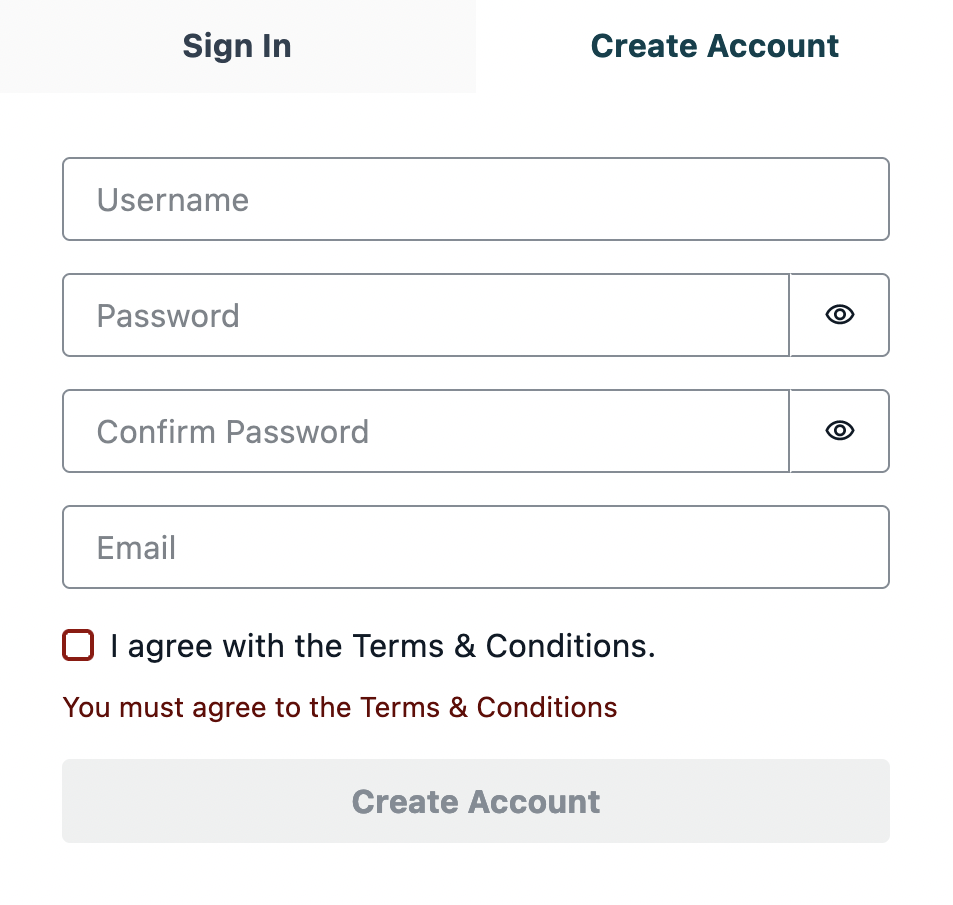
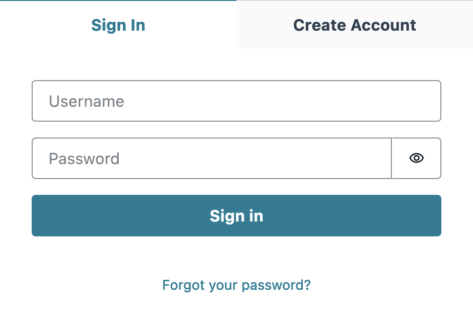
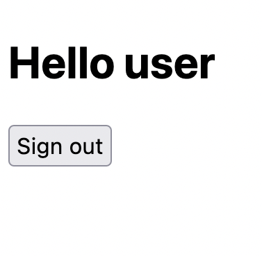

# React App with Amplify Authentication using TypeScript

This app uses the new version of Amplify Authenticator to provide a basic user authentication flow.

## Prerequisites

You will need to create an AWS Account. You will also need to install Node, npm and the Amplify CLI. For more information on installation, visit https://docs.amplify.aws/cli/start/install

## Deploy with the AWS Amplify Console

The AWS Amplify Console provides hosting for fullstack serverless web apps. Deploy this app to your AWS account with a single click:

[](https://console.aws.amazon.com/amplify/home#/deploy?repo=https://github.com/simsek97/cognito-authentication-patterns)

The Amplify Console will fork this repo in your GitHub account, and then build and deploy your backend and frontend in a single workflow. Your app will be available at `https://main.appid.amplifyapp.com`.

## Preview





## Run locally with the Amplify CLI

1. Fork the repo in your account and then clone it as below.

```
git clone https://github.com/chloeesun/cognito_patterns
cd create-react-app-amplify-ui-workflow
```

2. Install dependencies

```
yarn install
```

2. Pull backend from AWS Amplify using appid and envname which can be found on the AWS Amplify UI.

```
amplify pull --appId appid --envName envname
```

3. Run application.

```
yarn start
```
